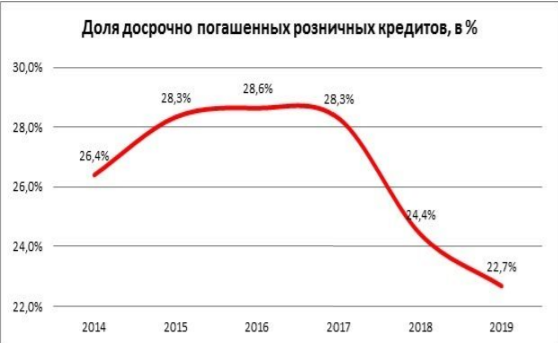

## KIKOFF - УЛУЧШЕНИЕ КРЕДИТНОЙ ИСТОРИИ
Без кредитов нет хорошей кредитной истории, без хорошей кредитной истории нет кредитов.

## Почему кредитная история важна?
В 2019 году начало сокращаться число заемщиков, которые закрывают кредиты досрочно. 
Доля таких погашений оказалась на самом низком уровне как минимум за шесть лет. 
Причины — рост финансовой нагрузки и падение доходов населения.

